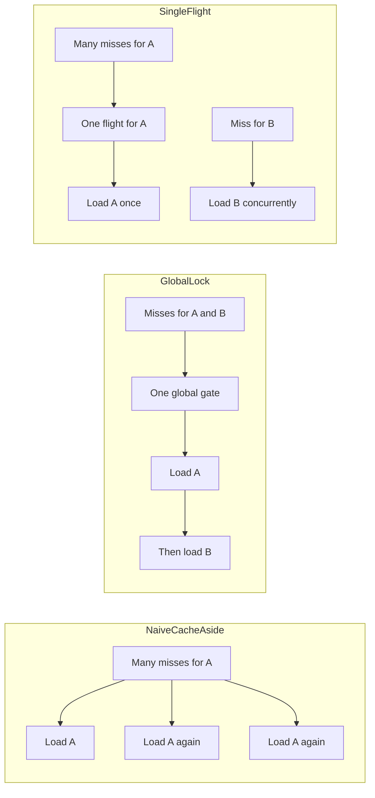
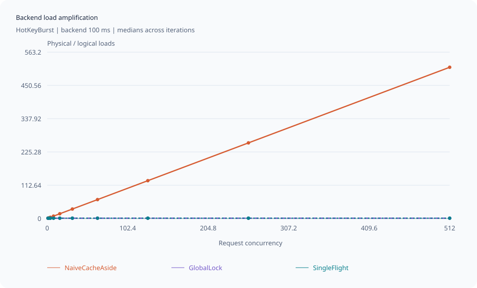
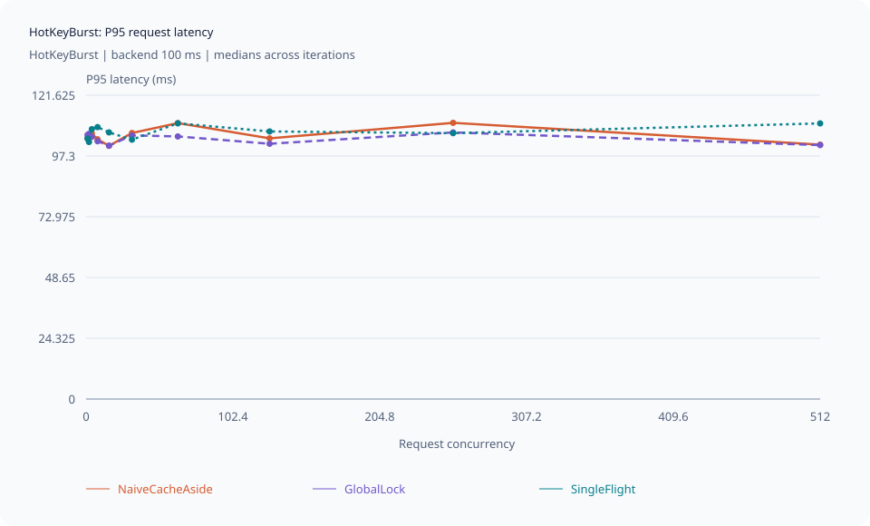
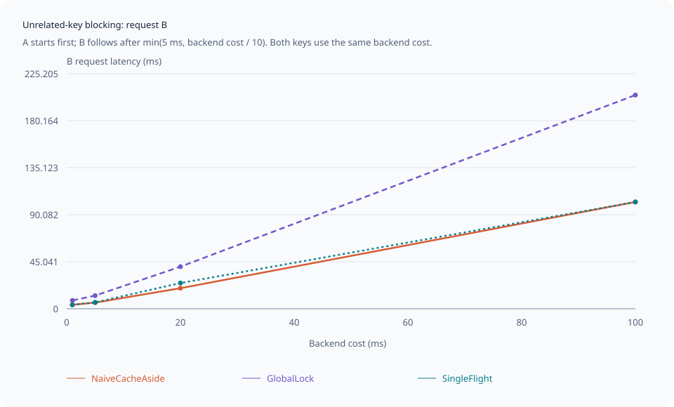

# single-flight-cache

A .NET 10 command-line lab that makes cache stampedes visible. Compare uncoordinated
cache-aside, one global asynchronous lock, and per-key single-flight using the same
logical workloads. Backend load counts, request latency, and coordination diagnostics
show the trade-off between duplicate work and serialization.

The solution and project names use the `SingleFlightCacheStampedeLab` prefix. The core library and
CLI have **no runtime NuGet dependencies**. Tests use xUnit.net v3 with Microsoft Testing
Platform. This is an educational in-process lab, not a production cache package.

## Quick start

Install a stable .NET 10 SDK compatible with [global.json](global.json):
10.0.400 or a newer 10.0 feature band. These commands work in PowerShell or Bash.

```sh
git clone https://github.com/andrii2g/single-flight-cache.git
cd single-flight-cache
dotnet restore SingleFlightCacheStampedeLab.slnx
dotnet run --project src/SingleFlightCacheStampedeLab.Cli -c Release -- scenario --scenario hot-key --strategy all --concurrency 128 --backend-ms 20 --output artifacts/hot-key
```

Run the quick comparison matrix or inspect the available commands:

```sh
dotnet run --project src/SingleFlightCacheStampedeLab.Cli -c Release -- quick --output artifacts/quick
dotnet run --project src/SingleFlightCacheStampedeLab.Cli -c Release -- help
```

In WSL or another Bash shell, the convenience scripts accept the same CLI options:

```bash
./scripts/run-quick.sh --output artifacts/quick
./scripts/run-full.sh --output artifacts/full
```

The full profile deliberately serializes hundreds of backend loads and takes many minutes.
For a full container workflow without a host .NET SDK, see [Docker and WSL](#docker-and-wsl).

## CLI reference

`dotnet run --project src/SingleFlightCacheStampedeLab.Cli -c Release -- <command> [options]`

| Command | Behavior |
| --- | --- |
| `quick` | Quick matrix plus a two-key blocking diagnostic |
| `sweep` | Matrix selected by `--profile quick\|full`; default: `quick` |
| `scenario` | One scenario; default: hot key with all strategies |
| `help`, `--help`, or `-h` | Show help; no arguments also shows help |

| Option | Accepted by | Values and defaults |
| --- | --- | --- |
| `--output` | All experiment commands | Directory; default: `artifacts/<UTC timestamp>-<command-or-profile>` |
| `--ttl-ms` | All experiment commands | Positive integer; default: 1000 |
| `--iterations` | All experiment commands | Positive integer; defaults: scenario 1, quick 3, full 5 |
| `--profile` | `sweep` | `quick` or `full`; default: `quick` |
| `--scenario` | `scenario` | See the scenario table below; default: `hot-key` |
| `--strategy` | `scenario` | `naive`, `global-lock`, `singleflight`, or `all`; default: `all` |
| `--concurrency` | `scenario` | Positive integer; default: 128, or exactly 2 for unrelated-key blocking |
| `--backend-ms` | `scenario` | Nonnegative integer; default: 20 |

Matrix commands use their profile's scenario, strategy, concurrency, and backend-cost
dimensions. Use `scenario` to select those dimensions yourself. For example:

```sh
dotnet run --project src/SingleFlightCacheStampedeLab.Cli -c Release -- scenario --scenario mixed-keys --strategy singleflight --concurrency 256 --backend-ms 50 --ttl-ms 1000 --iterations 3 --output artifacts/mixed
dotnet run --project src/SingleFlightCacheStampedeLab.Cli -c Release -- sweep --profile full --output artifacts/full
```

Malformed values, duplicate flags, and incompatible options exit **2**. Experiment
failures and Ctrl+C cancellation exit **1**; success exits **0**.

## What the three strategies do

A cache stampede (or thundering herd) happens when many callers observe a missing or
expired value together. Without coordination, each caller can start the same expensive
backend work before any caller populates the cache.



- **NaiveCacheAside** starts a backend load on every observed miss. Duplicate attempts
  still return equal values: attempt IDs are diagnostics, never part of the payload.
- **GlobalLock** uses one `SemaphoreSlim(1, 1)`. It double-checks the cache after
  acquisition, avoiding same-key duplication while also serializing unrelated cold keys.
  Cache hits bypass the gate.
- **SingleFlight** inserts an inert `Flight<BackendValue>` into a concurrent dictionary.
  Only the insertion winner starts backend work. Other callers await that flight's task;
  different keys have different flights.

### The GetOrAdd trap

`ConcurrentDictionary.GetOrAdd` may execute its value factory more than once. This is
incorrect when the factory eagerly starts work:

```csharp
// Multiple factories can start multiple loads even though only one task is stored.
var task = flights.GetOrAdd(key, _ => LoadAndCacheAsync(key));
```

The lab instead inserts an **unstarted coordination object**, checks which instance won,
then starts exactly one leader. The leader checks the cache again to cover a previous
flight completing between the initial miss and election.

### Cancellation, failure, and cleanup

Every single-flight caller, including the leader caller, uses
`flight.Task.WaitAsync(callerToken)`. Canceling a caller abandons only that wait.
The shared backend operation uses `CancellationToken.None` and can still populate
the cache for surviving or later callers.

Backend failures are delivered through the shared task, never cached. Completed or failed
flights are retired, and a later request can retry. Cleanup compares **both key and exact
flight instance** atomically, so an old leader cannot remove its replacement. A deterministic
registry test pauses old cleanup, installs a replacement, and then resumes old cleanup.

`Expire` and `Clear` remove cached entries; they do not cancel or fence active loads.
A successful active load can repopulate the store. Generation changes in experiments happen
only between waves. Dispose a global-lock strategy only after all its requests finish;
reset diagnostics only while idle. On Ctrl+C the CLI stops waiting and exits; single-flight
work still in progress is not canceled by a caller token.

## Scenarios and sweeps

| Scenario option | Workload | Expected logical loads |
| --- | --- | --- |
| `hot-key` | Synchronized cold requests for `hot` | 1 |
| `simultaneous-expiration` | Prime generation N, advance, explicitly expire, then burst | 1, excluding priming |
| `mixed-keys` | 70% hot, 10% each alpha/beta/gamma | Number of represented keys |
| `independent-keys` | One distinct cold key per caller | Concurrency |
| `unrelated-key-blocking` | Start A, then B after a small wave offset | 2 |

Mixed-key cold counts are `floor(concurrency / 10)` each; all remainder goes to hot.
For 17 callers this is 14/1/1/1. A fixed xorshift32 Fisher-Yates shuffle uses seed **1729**,
recorded in JSON and CSV.

Bursts use a two-phase ready/release gate: the coordinator knows all callers have arrived
before releasing anyone. Correctness tests use explicit backend gates and a manual clock,
without sleep-based ordering or TTL assertions.

The unrelated-key CLI experiment always has two callers (use `--concurrency 2` if supplied).
Both keys have the configured backend cost; their names describe ordering, not different
costs. B starts after `min(5 ms, backend cost / 10)`; its latency excludes that initial offset.
The ordering tests use controllable backend entry/release signals instead of elapsed delays.

| Profile | Scenarios | Concurrency | Backend cost | Iterations |
| --- | --- | --- | --- | --- |
| quick | Hot, independent, mixed | 1, 8, 32, 128, 256 | 5, 20 ms | 3 |
| full | All five | 1, 2, 4, 8, 16, 32, 64, 128, 256, 512 | 1, 5, 20, 100 ms | 5 |

Quick also adds a two-caller unrelated-key diagnostic for each backend cost, so its blocking
chart has actual measurements. Full runs the two-caller scenario once per backend cost,
instead of repeating it for irrelevant concurrency values. Quick records **288** rows;
full records **2,460** rows. Each run has a fresh strategy, store, and backend. One small
warm-up per selected strategy precedes the matrix and is excluded from output.

**Full takes many minutes by design.** Its independent-key/global-lock cases alone require
over ten minutes of configured backend delay across five iterations. Console tables show
progress after each scenario/concurrency/cost group.

## Metrics and output

Before reporting, every request must succeed and return the expected key, generation,
and deterministic payload `value:{key}:generation:{generation}`. An invalid run fails
with request context instead of printing performance metrics for that run.

- Duplicate work: `max(0, actual loads - expected logical loads)`.
- Amplification: `actual loads / max(1, expected logical loads)`.
- Throughput: successful requests divided by experiment wall time.
- Coalescing ratio: coalesced callers divided by `max(1, cache misses)`.
- P50/P95/P99: nearest rank, `sorted[max(0, ceil(p / 100 * n) - 1)]`.
  Empty inputs are rejected. Maximum latency is also recorded.
- A cache hit/miss describes the **initial lookup**; a lock double-check hit is still
  an initial miss. The leader is not a flight waiter.
- Lock wait is the sum of callers' waits, including canceled waits; it can exceed wall time.
  Unrelated-key wait is classified from the holder key observed at contention time.
  That diagnostic is approximate under races and never affects correctness.
- Peak waiters counts currently waiting coalesced callers across the strategy.
  Peak backend concurrency counts physical loads.
- Request and experiment duration use monotonic `Stopwatch` timestamps. TTL and
  backend timestamps use `TimeProvider`; equality at the expiry boundary means expired.

Console, JSON summaries, and charts use the **median of each scalar across iterations**.
For even iteration counts this averages the two middle values. A median of run P95 values
is not a pooled percentile; independently aggregated metrics need not obey all raw-row
identities. CSV retains every recorded iteration.

Explicit `--output` writes directly to that directory and replaces the five named reports.
Without it, the directory is `artifacts/<UTC timestamp>-<command-or-profile>`.

```text
raw-results.csv
summary.json
backend-amplification.svg
p95-latency-vs-concurrency.svg
unrelated-key-blocking.svg
```

CSV uses invariant numbers and stable columns. JSON includes runtime/OS/architecture,
processor count, container detection, profile, sanitized CLI arguments, raw metrics,
and median summaries; it omits hostname and redacts the output path. Priming and warm-up
loads are excluded from measurements.

SVGs use XML-escaped text, linear axes, named series, ticks, and legends, with no scripts
or chart library. Open them directly in a browser. Amplification and P95 charts select
HotKeyBurst at the largest backend cost in the run; their titles identify this selection.
The blocking chart shows B latency against backend cost. A single-scenario run without
the required chart data produces an explicitly labeled empty chart. Generated artifacts
are ignored by Git; the curated [documentation snapshot](docs/results/README.md) lives under `docs/results/`.

## Measured results

These charts and the table below come from the **same full sweep** recorded on
2026-09-19: .NET 10.0.12, Ubuntu 24.04.5 LTS in Docker through WSL, x64, 16 logical
processors, a 1,000 ms TTL, and five iterations per combination. Lines and table cells
show per-scalar medians. See the [source measurements and reproduction notes](docs/results/README.md).

### Same key: duplicate backend work

With a 100 ms backend cost, naive cache-aside's physical load count grows with the
synchronized caller count. GlobalLock and SingleFlight stay at one load per burst.
Their two lines overlap at 1x.



### Same key: latency alone hides the stampede

The same callers see roughly one backend delay under all three strategies, even though
naive cache-aside performs much more physical work. Read this latency chart together
with the amplification chart; similar latency does not imply similar backend pressure.



### Different keys: a global lock makes B wait

A begins loading first; B requests a different key after the configured wave offset.
At a 100 ms backend cost, median B latency was about 205 ms with GlobalLock and 102 ms
with either of the other strategies. The global gate serializes two necessary loads.



### Snapshot at 128 callers

These rows use a **20 ms backend cost**, rather than the 100 ms used in the two hot-key
charts above. Independent keys make the global lock's serialization cost especially clear.

| Scenario | Strategy | Physical loads | Amplification | P95 ms |
| --- | --- | ---: | ---: | ---: |
| Hot key | NaiveCacheAside | 128 | 128.00x | 22.75 |
| Hot key | GlobalLock | 1 | 1.00x | 22.48 |
| Hot key | SingleFlight | 1 | 1.00x | 21.38 |
| Independent keys | NaiveCacheAside | 128 | 1.00x | 22.61 |
| Independent keys | GlobalLock | 128 | 1.00x | 2734.33 |
| Independent keys | SingleFlight | 128 | 1.00x | 21.31 |
| Mixed keys | NaiveCacheAside | 128 | 32.00x | 22.26 |
| Mixed keys | GlobalLock | 4 | 1.00x | 88.84 |
| Mixed keys | SingleFlight | 4 | 1.00x | 22.28 |

The hot-key rows show duplication; independent keys expose global serialization.
Mixed keys show both effects. These are observations from this run, not latency
expectations or claims about a universally faster strategy.

## Docker and WSL

Run these commands from the repository root in WSL with a running Docker engine or
Docker Desktop WSL integration. The host does not need the .NET SDK.

```bash
docker version

# Test the mounted working tree:
docker compose run --rm test

# Build the current source and run the quick profile:
docker compose run --build --rm lab

# Run the full profile and keep its output separate:
docker compose run --build --rm lab sweep --profile full --output /app/artifacts/full
```

Use `--build` when source files have changed. After building the image, subsequent runs
can use `docker compose run --rm lab`. The default lab command writes its quick reports
directly to host `./artifacts`; paths under `/app/artifacts` map to that directory.

For a hermetic restore/build/test of copied source and a standalone runtime image:

```bash
docker build --target tests -t singleflight-cache-stampede-lab-tests .
docker build -t singleflight-cache-stampede-lab .
docker run --rm \
  -v "$PWD/artifacts:/app/artifacts" \
  singleflight-cache-stampede-lab quick --output /app/artifacts
```

The test service caches NuGet packages in a named volume and uses a separate build
volume to avoid mixing Linux and Windows build outputs. Build/test uses
`mcr.microsoft.com/dotnet/sdk:10.0-noble`; the final image uses
`mcr.microsoft.com/dotnet/runtime:10.0-noble`. No external services or privileged
containers are required.

## Development and validation

From the repository root:

```sh
dotnet restore SingleFlightCacheStampedeLab.slnx
dotnet build SingleFlightCacheStampedeLab.slnx -c Release --no-restore
dotnet test --solution SingleFlightCacheStampedeLab.slnx -c Release --no-build
dotnet format SingleFlightCacheStampedeLab.slnx --verify-no-changes --no-restore
```
